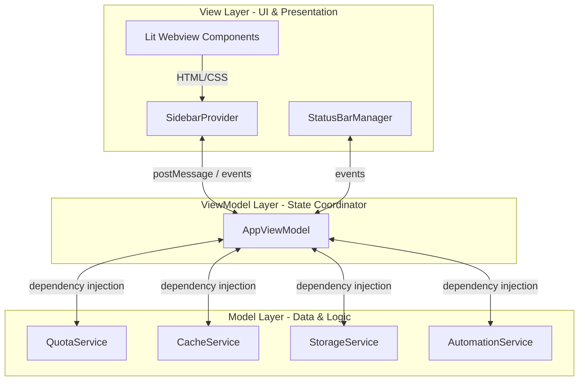

# Contributing to Antigravity Panel

Thank you for your interest in contributing to **Antigravity Panel**! Contributions from the community help make this extension robust, secure, and user-friendly.

This guide outlines our development workflow, project architecture, coding standards, and testing procedures. Please review it before submitting a Pull Request.

---

## 🏗️ Project Architecture

This extension follows a strict **MVVM (Model-View-ViewModel)** architectural pattern. Keeping these concerns separated ensures that business logic remains independent of the IDE's environment and can be easily unit tested in a pure Node.js runtime.



### 1. Model (Services)
Located in `src/model/services/`. These classes perform the actual business logic, file system scans, and HTTP requests:
*   [QuotaService](src/model/services/quota.service.ts): Communicates with the local Antigravity Language Server via HTTP.
*   [CacheService](src/model/services/cache.service.ts): Handles directory sizing and file deletion under the `~/.gemini/antigravity-ide/` workspace folders.
*   [StorageService](src/model/services/storage.service.ts): Stores usage history and user configuration state globally.
*   [AutomationService](src/model/services/automation.service.ts): Drives the Auto-Accept polling/CDP injection fallback engine.

### 2. ViewModel
Located in [app.vm.ts](src/view-model/app.vm.ts). The `AppViewModel` acts as the single source of truth for the application state (`AppState`). It translates model data into formats optimized for display and broadcasts updates through events (`onStateChange`, `onQuotaChange`, etc.).

### 3. View (Presentation)
*   **IDE Integration:** [SidebarProvider](src/view/sidebar-provider.ts) hosts the webview, while [StatusBarManager](src/view/status-bar.ts) handles status bar entries.
*   **Lit Components:** The webview frontend in `src/view/webview/components/` is built using the **Lit** library. Communication between the webview (browser environment) and the extension (Node.js environment) occurs via standard Extension API webview messages.

---

## 🛠️ Development & Environment Setup

### Prerequisites
*   **Antigravity IDE**. Development, debugging, and testing for this extension must be done in Antigravity IDE, not generic VS Code.
*   A running local **Antigravity Language Server**. The extension is designed around the local Language Server that Antigravity IDE starts.
*   [Node.js](https://nodejs.org/) 24 or later.
*   `npm` (v10+).

### Quick Start Setup
1.  Fork and clone the repository:
    ```bash
    git clone https://github.com/n2ns/antigravity-panel.git
    cd antigravity-panel
    ```
2.  Install all dependencies:
    ```bash
    npm install
    ```
3.  Launch local compilation in watch mode:
    ```bash
    npm run watch
    ```
    This launches `esbuild.js` in watch mode to automatically compile changes in `src/extension.ts` (Extension backend), webview components (Webview frontend), and CSS styles.

### Testing Inside Antigravity IDE
1.  Open the workspace in **Antigravity IDE**.
2.  Press **`F5`** (or go to the *Run and Debug* panel and select **Run Antigravity Panel (Extension Host)**).
3.  A new **Antigravity IDE Extension Development Host** window will open. In this sandbox environment, the extension will directly connect to your local **Antigravity Language Server** instance. This allows you to verify UI changes with real live quota metrics, token credits, and cache tracking.

---

## 🧪 Testing Requirements

We enforce strict test coverage requirements. Ensure that your contributions do not break existing tests and that you write new tests for any added features or bug fixes.

*   **Unit and local integration tests:** Verify core business logic, platform parsing, and live Antigravity Language Server behavior from the current Antigravity IDE environment.
    ```bash
    npm test
    ```
*   **Server integration tests:** Run the live Language Server integration subset directly.
    ```bash
    npm run test:server
    ```

> [!IMPORTANT]
> The live Language Server tests are expected to run in Antigravity IDE development environments. If they cannot find a local Antigravity Language Server, the environment is incomplete for full project validation.

> [!IMPORTANT]
> `husky` and `lint-staged` run lint checks before commits. Run `npm test` and `npm run test:server` manually before opening a Pull Request.

---

## 📦 Build & Packaging

Run a production build before packaging:

```bash
npm run build
```

To create a local `.vsix` installer:

```bash
npm run package
```

The package script uses the compiled output under `dist/`, so rebuild after source changes.

---

## 🎨 Code Style & Standards

We use `eslint` and `typescript` strict mode to maintain code quality.

*   Run the linter manually to check your changes:
    ```bash
    npm run lint
    ```
*   **Formatting Rules:** We enforce standard JavaScript/TypeScript style with strict rules, such as:
    *   No unused imports or variables (except prefixed with `_`).
    *   Minimize `any` types (use type parameters or unknown instead).
    *   Always write comprehensive types for views and messages.

### 🌐 Localization & Translation Policy
The extension supports 14 languages. To maintain technical consistency across all locales, we enforce the **UI Label Strategy** defined in [LOCALIZATION_RULES.md](docs/LOCALIZATION_RULES.md):
1.  **UI Buttons, Section Headers, and Command Titles** must remain in **English** (e.g., `Rules`, `MCP`, `Auto-Accept`, `Reset Status`). Do not translate these.
2.  **Tooltips, Descriptions, Explanations, and Warnings** must be fully **localized** in NLS files (e.g. `package.nls.zh-cn.json`, `bundle.l10n.zh-cn.json`).

---

## 🚀 Pull Request (PR) Workflow

1.  **Create a Branch:** Create a branch named `feature/your-feature-name` or `bugfix/your-fix-name`.
2.  **Make Code Changes:** Keep your commits clean and focused. Use descriptive conventional commits titles (e.g., `feat: ...`, `fix: ...`).
3.  **Run Quality Checks:**
    *   Format and lint: `npm run lint`
    *   Ensure all tests pass: `npm test` and `npm run test:server`
4.  **Create a Pull Request:**
    *   Push your branch and open a PR against the `main` branch.
    *   Provide a clear summary of your changes and reference any related issues (e.g., `Fixes #123`).
    *   Wait for the maintainers to review and merge your PR.

Thank you for helping us build a better Antigravity Panel!
