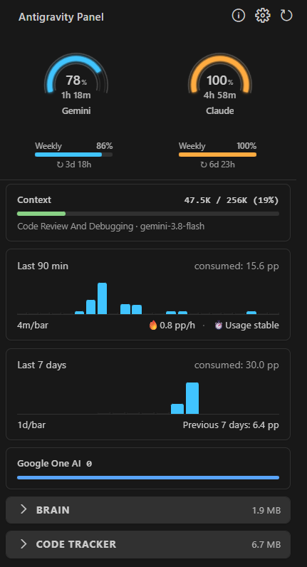
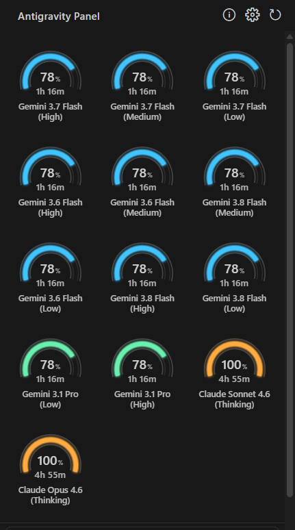

  

# Antigravity Panel

> Real-time AI quota monitor & cache manager for **Google Antigravity IDE** — track Gemini, Claude, and GPT usage, visualize consumption trends, and manage conversation cache, all in one sidebar panel.

> 🚀 **Featured in Google AI Blog:** [Where we're going, we don't need chatbots: introducing the Antigravity IDE](https://dev.to/googleai/where-were-going-we-dont-need-chatbots-introducing-the-antigravity-ide-2c3k)

**Antigravity Panel** helps you stay on top of your AI model usage in **Google Antigravity IDE**. Get real-time quota monitoring, usage trends, and cache management—all within an integrated sidebar panel.

## ✨ Features at a Glance

- 🎯 **Quota Monitoring** - Real-time status with visual thresholds
- 📊 **Usage Analytics** - Interactive charts and history tracking
- 🧹 **Cache Management** - Manage AI conversation history and files
- 🎨 **Native Integration** - UI components adapted to IDE themes
- 🌍 **Localization** - Support for 15 languages including runtime notifications
- 🛠️ **Diagnostics** - Built-in connection check and error reporting
- 🤖 **Hands-free Mode** - Auto-accept agent steps and file edits, with opt-in terminal command approval
- ✍️ **AI Commit** - Generate commit messages via Local LLM or Claude
- ⚙️ **Quick Config Access** - One-click editing for Rules, MCP, and Allowlist
- 🔄 **Service Recovery** - Restart, Reset, and Reload tools for Antigravity IDE stability

## 📸 Screenshots

| | |
|:---:|:---:|
|  |  |
|  |  |

*Real-time quota monitoring, usage trends, and cache management in one place*

## 🚀 Key Features

### 📊 Smart Quota Monitoring

See how much quota each model pool has left, its official weekly limit, and when it resets. The status bar turns yellow and then red as quota runs low (thresholds are configurable), and hovering it shows every pool at once. [Details →](docs/FEATURES.md#real-time-quota-display)

### 📈 Usage Trends

A chart of recent quota consumption by pool, plus your current usage rate and an estimate of how long the remaining quota will last. History is kept for 14 days. [Details →](docs/FEATURES.md#usage-history--analytics)

### 💳 Credits

Shows your Google One AI subscription credit; Prompt and Flow credit rows can be turned on in settings. [Details →](docs/FEATURES.md#token-credits-tracking)

### 🗂️ Cache Management

Browse, preview, and delete the IDE's conversation (**Brain**) and **Code Tracker** caches, with a confirmation before anything is deleted. **Clean Cache** shows what it will remove first and always keeps your most recently active tasks. [Details →](docs/FEATURES.md#brain-tasks-management)

### 🤖 Auto-Accept (Hands-free Mode)

Let the agent work through long tasks without clicking "Accept" on every step and file edit. Off by default; turn it on with the **Auto-Accept** switch in the sidebar footer. Approving terminal commands is a separate opt-in and needs the IDE started with `--remote-debugging-port=9222`.

> [!WARNING]
> Only use Auto-Accept for tasks you trust. [How it works, setup, and what it never clicks →](docs/FEATURES.md#-auto-accept-hands-free-mode)

### ✍️ Commit Message Generator

Generate a commit message for your staged changes with a local LLM (such as Ollama) or Claude, as a workaround when the built-in generator is unavailable. Your staged diff is sent to the endpoint you configure. [Setup →](docs/FEATURES.md#choosing-a-model)

### 🔄 Service Recovery

**Restart**, **Reset**, and **Reload** buttons in the sidebar footer for when the Agent stops responding or quota stops updating. [Details →](docs/FEATURES.md#-service-recovery)

### ⚙️ Quick Configuration Access

One click from the sidebar footer to your global Rules, MCP settings, and Browser Allowlist. [Details →](docs/FEATURES.md#one-click-shortcuts)

### 🌐 Works Everywhere

Windows, macOS, and Linux, in 15 languages: English, 简体中文, 繁體中文, 日本語, Français, Deutsch, Español, Português (Brasil), Bahasa Indonesia, Italiano, 한국어, Русский, Polski, Türkçe, Tiếng Việt. UI labels and technical terms stay in English in every locale.

## 📦 Installation

### Install from Extension Marketplace

1. Open **Antigravity IDE**
2. Press `Ctrl+Shift+X` (Windows/Linux) or `Cmd+Shift+X` (macOS) to open Extensions
3. Search for `Antigravity Panel`
4. Click **Install**

**Or install from web:**
- [Extension Marketplace](https://marketplace.visualstudio.com/items?itemName=n2ns.antigravity-panel)
- [Open VSX Registry](https://open-vsx.org/extension/n2ns/antigravity-panel)

### Manual Install from GitHub Releases

If the marketplace is unavailable or you need a specific version:

1. Download the `.vsix` file from [GitHub Releases](https://github.com/n2ns/antigravity-panel/releases)
2. Open Antigravity IDE → Extensions panel
3. Click `⋯` (More Actions) → `Install from VSIX...`
4. Select the downloaded `.vsix` file

For version history and release notes, see the [Changelog](CHANGELOG.md).

## 🎯 Quick Start

### Step 1: Open the Panel

Click the **Antigravity** icon in the sidebar, or:
- Press `Ctrl+Shift+P` (Windows/Linux) or `Cmd+Shift+P` (macOS)
- Type `Antigravity Panel: Open Panel`
- Press Enter

### Step 2: Monitor Your Quota

- **Pie charts** show each shared quota pool once; model view keeps individual models
- **Hover** over charts to see detailed limits
- **Status bar** displays active model quota and cache size
- **Usage chart** shows consumption trends

### Step 3: Manage Cache

- Expand **Brain** or **Code Tracker** sections
- Click 🗑️ to delete tasks or caches, then confirm in the dialog
- Related editor tabs close automatically

> ⚠️ **Note**: Deleting tasks removes conversation history and artifacts permanently.

## 🛠️ Available Commands

Open Command Palette (`Ctrl+Shift+P` / `Cmd+Shift+P`) and search for:

| Command | What it does |
|---------|-------------|
| `Antigravity Panel: Open Panel` | Open the sidebar panel |
| `Antigravity Panel: Refresh Quota` | Manually refresh quota data |
| `Antigravity Panel: Show Cache Size` | Show total cache size notification |
| `Antigravity Panel: Clean Cache` | Show a cleanup plan, then delete it after confirmation; the most recently active tasks are kept (use with caution!) |
| `Antigravity Panel: Open Settings` | Open extension settings |
| `Antigravity Panel: About` | View privacy and safety disclaimer |
| `Antigravity Panel: Restart Agent Service` | Restart Antigravity Agent Service |
| `Antigravity Panel: Reset Status` | Reset the status updater |
| `Antigravity Panel: Connectivity Diagnostics` | Run connectivity diagnostics |
| `Antigravity Panel: Show Logs` | Open the Output panel log |
| `Antigravity Panel: Toggle Agent Auto-Accept` | Enable/Disable Auto-Accept (Hands-free Mode) |
| `Antigravity Panel: Generate Commit Message (Local & Claude)` | Generate commit message using Local LLM or Claude |
| `Antigravity Panel: Set Anthropic API Key` | Configure Anthropic API Key |

## ⚙️ Configuration

Open Settings (`Ctrl+,` / `Cmd+,`) in Antigravity IDE and search for `tfa` to customize quota polling, status bar thresholds, cache cleaning, Auto-Accept, and the commit message generator.

The complete list of settings with their defaults is in [FEATURES.md](docs/FEATURES.md#-configuration-options).

## 🔒 Privacy & Safety Disclaimer

**Your data stays under your control.**

Antigravity Panel does not collect or store analytics data. Quota, cache, diagnostics, and core panel operations communicate with local Antigravity IDE components on your machine. The optional commit message generator sends staged diffs only to the LLM endpoint you configure, which may be local or external.

**Experimental Feature Notice:**
The *Smart Quota Monitoring* feature relies on internal metrics exposed by the local Antigravity environment. This functionality is experimental and provided "as-is" to help users better understand their personal usage. It is not an official Google product and may be subject to changes in future IDE updates.

See the full [Disclaimer](docs/DISCLAIMER.md).

## 🤝 Contributing

We welcome contributions. See [CONTRIBUTING.md](CONTRIBUTING.md) for environment setup, Extension Host debugging, quality checks, packaging, and the PR workflow.

If you find Antigravity Panel helpful, please give us a **Star** 🌟 on GitHub. It's the best way to support our work and help others discover it.

1. **Report bugs**: [Open an issue](https://github.com/n2ns/antigravity-panel/issues)
2. **Suggest features**: [Start a discussion](https://github.com/n2ns/antigravity-panel/discussions)
3. **Submit code**: Fork, code, test, and [open a PR](https://github.com/n2ns/antigravity-panel/pulls)

For major changes, please open an issue first to discuss your ideas.

## 🤝 Contributors

Special thanks to our community contributors:

*   [**@iskisraell**](https://github.com/iskisraell) - Windows platform stability fixes (v2.5.6).
*   [**@simbaTmotsi**](https://github.com/simbaTmotsi) - Local LLM Commit Message Generator.
*   [**@A-vrice**](https://github.com/A-vrice) - Japanese localization.
*   [**@restinnotes**](https://github.com/restinnotes) - CDP Auto-Accept implementation.
*   [**@AMDphreak**](https://github.com/AMDphreak) - Sidebar title fix, Gemini Flash/Pro grouping, quota reset window alignment with API cycles, and Claude+GPT shared pool display.
*   [**@chonkydonkers**](https://github.com/chonkydonkers) - Display user tier available credits in status bar and sidebar.
*   [**@vincenzofabiano92**](https://github.com/vincenzofabiano92) - Synchronous command registration, connection stability optimization, Italian NLS localization, and server integration test runner (v2.6.0).

## 📄 License

Licensed under the [Apache License, Version 2.0](LICENSE).

*Formerly published as **Toolkit for Antigravity**.*

## ⭐ Star History

<a href="https://star-history.com/#n2ns/antigravity-panel&Date">
  <picture>
    <source media="(prefers-color-scheme: dark)" srcset="https://api.star-history.com/svg?repos=n2ns/antigravity-panel&type=Date&theme=dark">
    
  </picture>
</a>

## ❤️ Support

If Antigravity Panel has saved you time, consider supporting continued development:

---

Built by [N2NS Lab](https://n2ns.com), the open-source lab of [datafrog.io](https://datafrog.io) for practical AI developer tools.

*For Antigravity. By Antigravity.*
