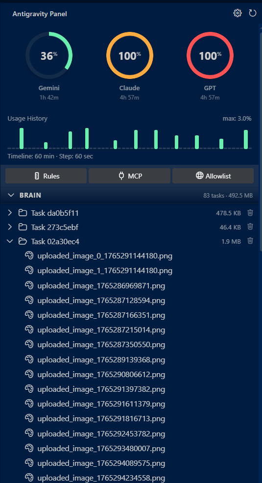

[English](README.md) | 中文文档

# Antigravity Panel

> Google Antigravity IDE 缓存与配额管理扩展

[](LICENSE)
[](https://marketplace.visualstudio.com/items?itemName=n2ns.antigravity-panel)
[](https://marketplace.visualstudio.com/items?itemName=n2ns.antigravity-panel)
[](https://open-vsx.org/extension/n2ns/antigravity-panel)
[](https://open-vsx.org/extension/n2ns/antigravity-panel)
[](https://code.visualstudio.com/)

**Antigravity Panel** 是一款 VS Code 扩展，用于集成本地 Antigravity Language Server。它提供 AI 模型配额使用情况的实时可视化展示，并支持管理 AI 会话过程中生成的文件系统缓存。

## 功能特性

### 配额监控
- **分组可视化**: 根据可配置的分组策略，按模型家族（Gemini, Claude, GPT）显示配额使用情况
- **实时更新**: 自动检测并连接本地 Antigravity Language Server
- **状态栏集成**: 在 IDE 状态栏显示当前活跃模型的剩余配额和总缓存大小
- **可配置阈值**: 当配额低于自定义阈值时显示视觉警告

### 用量历史与趋势
- **交互式柱状图**: 可视化展示可配置时间范围（10-120 分钟）内的配额消耗情况
- **24 小时历史**: 追踪并持久化配额使用数据以进行趋势分析
- **颜色编码分组**: 使用 `quota_strategy.json` 中的主题色区分模型家族
- **堆叠可视化**: 在单个图表中显示多组使用情况

### 缓存与任务管理
- **Brain 任务浏览器**: 浏览和管理存储在 `~/.gemini/antigravity/brain/` 中的 AI 对话任务
  - 查看任务元数据（大小、文件数、创建日期）
  - 展开任务查看包含的文件（图片、Markdown、代码）
  - 删除单个任务并自动清理
- **代码上下文缓存**: 管理 `~/.gemini/antigravity/code_tracker/active/` 中的代码分析缓存
  - 查看每个项目的缓存大小
  - 删除特定项目的缓存
- **智能清理**: 删除任务或文件时自动关闭相关的编辑器标签页和预览窗口

### 配置快捷方式
- 快速访问 **全局规则** (`~/.gemini/GEMINI.md`)
- 快速访问 **MCP 配置** (`~/.gemini/mcp.json`)
- 快速访问 **浏览器白名单** (`~/.gemini/browser_allowlist.json`)

### 跨平台支持
- Windows（基于 PowerShell/WMIC 的进程检测）
- macOS（基于 ps/lsof 的进程检测）
- Linux（基于 ps/lsof 的进程检测）

### 多语言支持
- **配置与命令本地化**: 提供 11 种语言的完整界面支持：
  - English, 简体中文, 繁體中文, 日本語, Français, Deutsch
  - Español, Português (Brasil), Italiano, 한국어, Русский

## 界面概览



## 安装说明

### 安装

**Visual Studio Marketplace** 与 **Open VSX Registry**
在 IDE 的扩展视图 (`Ctrl+Shift+X`) 中搜索 `Antigravity Panel` 即可直接安装。

或者通过网页安装：
- [VS Code Marketplace](https://marketplace.visualstudio.com/items?itemName=n2ns.antigravity-panel)
- [Open VSX Registry](https://open-vsx.org/extension/n2ns/antigravity-panel)

### 源码构建
```bash
git clone https://github.com/n2ns/antigravity-panel.git
cd antigravity-panel
npm install
npm run build
```

## 使用指南

1.  **打开面板**: 点击侧边栏图标或运行命令 `Antigravity Panel: Open Panel`。
2.  **查看配额**: 悬停在饼图上可查看具体的模型限制数据。
3.  **管理缓存**:
    *   展开 **Brain** 或 **Code Tracker** 查看详情。
    *   点击垃圾桶图标 🗑️ 删除任务或上下文缓存。
    *   *删除操作将移除相关的对话记录及文件。*

### 命令列表
| 命令 | 说明 |
|------|------|
| `Antigravity Panel: Open Panel` | 打开侧边栏 Webview 面板 |
| `Antigravity Panel: Clean Cache` | 清除所有缓存数据 (Brain + Contexts) |
| `Antigravity Panel: Refresh Quota` | 触发配额与缓存数据刷新 |
| `Antigravity Panel: Show Cache Size` | 通过通知显示当前缓存总大小 |

## 配置选项

在 VS Code 设置 (`Ctrl+,` 或 `Cmd+,`) 中搜索 `gagp` 前缀进行配置。

### 配额设置

| 配置项 | 默认值 | 范围 | 说明 |
|--------|--------|------|------|
| `gagp.pollingInterval` | `120` | 60-∞ | 自动刷新间隔（秒），最小值 60 秒，推荐 120 秒以减少服务器负载 |
| `gagp.showQuota` | `true` | - | 在状态栏中显示配额信息 |
| `gagp.visualizationMode` | `groups` | - | 侧边栏显示模式：`groups` (按类别分组) 或 `models` (单独显示所有模型) |
| `gagp.quotaWarningThreshold` | `30` | 5-100 | 配额低于此百分比时显示警告颜色 |
| `gagp.quotaCriticalThreshold` | `10` | 1-50 | 配额低于此百分比时显示严重警告颜色 |
| `gagp.historyDisplayMinutes` | `60` | 10-120 | 使用历史图表的时间范围（分钟） |

### 缓存设置

| 配置项 | 默认值 | 范围 | 说明 |
|--------|--------|------|------|
| `gagp.showCacheSize` | `true` | - | 在状态栏中显示 Antigravity IDE 缓存大小 |

**已移除的配置项**（未实现）：
- `gagp.quotaDisplayStyle` — 状态栏固定显示百分比格式
- `gagp.autoCleanCache` — 自动清理功能未实现
- `gagp.cacheWarningThreshold` — 缓存警告功能未实现

### 调试设置

| 配置项 | 默认值 | 说明 |
|--------|--------|------|
| `gagp.debugMode` | `false` | 启用调试模式：在 UI 中显示原始模型 ID，并将详细日志输出到 'Antigravity Panel' 频道（查看 > 输出） |

**如何启用调试日志：**
1. 打开 VS Code 设置 → 搜索 `gagp.debugMode`
2. 勾选启用
3. 打开输出面板：`查看` → `输出`（或 `Ctrl+Shift+U` / `Cmd+Shift+U`）
4. 从下拉菜单选择 `Antigravity Panel`
5. 查看详细的调试日志，包括 HTTP 请求、服务器响应和配额聚合过程

## 技术架构

### 核心组件
- **进程检测**: 跨平台策略模式，用于检测 Antigravity Language Server 进程
- **HTTP 客户端**: 自动 HTTPS→HTTP 降级，支持自签名证书的协议缓存
- **配额管理器**: 基于工厂模式的初始化，包含重试逻辑和错误处理
- **调度器**: 统一的任务调度系统，用于轮询和数据刷新
- **历史管理器**: 24 小时配额使用追踪，持久化存储（VS Code GlobalState）

### UI 层
- **框架**: LitElement 3.3（Web Components）+ MVVM 架构
- **组件**: 模块化组件（quota-pie、usage-chart、folder-tree 等）
- **样式**: 使用 VS Code 原生 CSS 变量以兼容主题
- **通信**: Extension Host 与 Webview 之间的消息传递

### 配置
- **策略驱动**: 模型分组定义在 `src/config/quota_strategy.json`
- **可扩展**: 易于添加新的模型家族或自定义分组规则

## 目录结构

| 目录 | 内容 |
|------|------|
| `~/.gemini/antigravity/brain/` | 任务产物与对话历史。 |
| `~/.gemini/antigravity/conversations/` | Protobuf 对话日志。 |
| `~/.gemini/antigravity/code_tracker/active/` | 代码上下文分析缓存。 |
| `~/.gemini/GEMINI.md` | 全局规则配置。 |

## 开发

### 项目结构
```
src/
├── core/           # 业务逻辑（QuotaManager、CacheManager、Scheduler 等）
├── ui/             # Webview 提供者和 HTML 构建器
│   └── webview/    # LitElement 组件
├── utils/          # 工具函数（HTTP 客户端、重试、格式化等）
└── config/         # 配置文件（quota_strategy.json）
```

### 从源码构建
```bash
git clone https://github.com/n2ns/antigravity-panel.git
cd antigravity-panel
npm install
npm run build        # 构建扩展和 webview
npm run watch        # 开发模式（监听文件变化）
npm test             # 运行所有单元测试
```

### 测试

项目包含 **113 个单元测试**，覆盖约 50% 的代码。所有测试都在纯 Node.js 环境中运行，无需 VS Code Extension Host，速度快（约 5 秒），适合 CI/CD。

所有测试都使用 Mock 对象，不需要运行中的 Antigravity IDE 实例。

查看 [`docs/TODO_zh.md`](docs/TODO_zh.md) 了解计划改进和已知问题。

## 贡献

欢迎贡献！请随时提交 Pull Request。

对于重大更改，请先开启 issue 讨论您想要更改的内容。

## 许可证

[MIT License](LICENSE)
