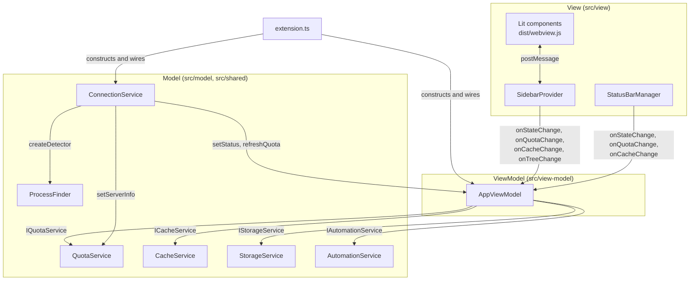

# Architecture

This document describes how Antigravity Panel is put together: the directories, the build, the MVVM layers, the Language Server connection, and the test setup. It is written for maintainers and for AI coding agents that need to change the code without breaking its boundaries. User-facing behavior is in [FEATURES.md](FEATURES.md); the quota domain model is in [QUOTA_DATA_MODEL.md](QUOTA_DATA_MODEL.md).

## Repository layout

```text
src/
  extension.ts                 Activation entry: registers commands, wires services, owns the scheduler
  commitMessageClaude.ts       LLM commit message generator (outside MVVM, see below)
  model/
    services/
      interfaces.ts            IQuotaService, ICacheService, IStorageService, IAutomationService
      quota.service.ts         GetUserStatus and RetrieveUserQuotaSummary requests and response parsing
      cache.service.ts         Scans and cleans ~/.gemini/antigravity-ide/{brain,conversations}
      storage.service.ts       globalState persistence: quota history and cache-first snapshots
      automation.service.ts    Auto-Accept loop (IDE commands, CDP fallback)
      connection.service.ts    Reconnect loop, failure counting, backoff
    types/entities.ts          Domain entities (re-exports shared/utils/types plus cache and history types)
    strategy.ts                QuotaStrategyManager: maps model ids to groups and quota pools
  view-model/
    app.vm.ts                  AppViewModel: single source of truth for AppState
    types.ts                   AppState, SidebarData, StatusBarData, WebviewMessage
  view/
    sidebar-provider.ts        WebviewViewProvider for tfa.sidebar; message routing
    status-bar.ts              StatusBarManager
    html-builder.ts            Webview HTML skeleton and CSP (no vscode dependency)
    webview.css                CSS entry; @imports styles/*.css
    styles/                    base, gauge, chart, toolbar, tree, footer CSS modules
    webview/
      index.ts                 Browser entry; imports sidebar-app
      types.ts                 Webview-side copies of the message and state types
      components/              Lit components (Light DOM)
      components/quota/        Gauge renderer contract and renderers (semi-arc, classic-donut)
      utils/tooltip-manager.ts Single global tooltip driven by data-tooltip attributes
      styles/shared.ts         File icon helpers
  shared/
    config/                    ConfigManager, IConfigReader, quota_strategy.json
    platform/                  ProcessFinder, platform strategies, AmbientDiscovery, detection utils
    utils/                     Scheduler, retry, http_client, logger, feedback_manager, paths, wsl,
                               workspace_id, config_targets, platform, format, gauge_math, constants, types
  test/
    runUnitTests.ts            Mocha runner for suite/**, vscode mocked
    runServerTests.ts          Mocha runner for suite/integration/** (live Language Server)
    mocks/vscode.ts            Minimal vscode API used by both runners
    suite/                     Unit tests (flat); suite/integration/ holds the live tests
scripts/
  check_l10n.js                Locale consistency check (npm run check:l10n)
  sync-build.js                postpackage: copies the .vsix to a Windows folder (WSL convenience)
  debug/                       Manual diagnostics (npm run debug:*), see DEBUGGING.md
l10n/bundle.l10n*.json         Runtime strings for vscode.l10n.t
package.nls*.json              Manifest strings (%key% placeholders in package.json)
dist/                          esbuild output (extension.js, webview.js, webview.css); gitignored
out/                           tsc output for tests and the debug entry; gitignored
assets/                        Extension icon and README previews
docs/                          Project documentation; only DISCLAIMER.md ships in the VSIX
```

## Build pipeline

[esbuild.js](../esbuild.js) builds three bundles in parallel:

| Entry | Output | Target |
| --- | --- | --- |
| `src/extension.ts` | `dist/extension.js` | Node, CJS, `vscode` external |
| `src/view/webview/index.ts` | `dist/webview.js` | Browser, ESM, chrome100 / safari15 / firefox100 |
| `src/view/webview.css` | `dist/webview.css` | CSS bundle of the `@import`ed `styles/*.css` |

The extension build registers an `exclude-webview` plugin: every import whose path contains `/webview/` is marked external, except `types` modules (`.../types`, `types.js`, `types.ts`). This keeps browser-only Lit code out of the Node bundle while still letting the host import webview type definitions.

- `npm run build` runs `node ./esbuild.js`: minified, no sourcemaps, `process.env.NODE_ENV` set to `"production"` in the webview bundle. `vscode:prepublish` runs it before `vsce package`.
- `npm run watch` runs `node ./esbuild.js --watch --sourcemap`: all three contexts stay in watch mode, output is not minified, sourcemaps are inline, `NODE_ENV` is `"development"`.

Three tsconfig files serve different consumers:

| File | Purpose |
| --- | --- |
| [tsconfig.json](../tsconfig.json) | `noEmit` typecheck of `src/**` except tests (`npm run typecheck`, ESLint). `moduleResolution: bundler`, DOM lib, `experimentalDecorators` and `useDefineForClassFields: false` for Lit decorators. |
| [tsconfig.test.json](../tsconfig.test.json) | Emits `src/{shared,model,view-model,view,test}` to `out/` as Node16 CJS with sourcemaps. `src/extension.ts` and `src/view/webview/**` are left out of the include set; files that tests import (for example `tooltip-manager.ts`) are still compiled. |
| [tsconfig.debug.json](../tsconfig.debug.json) | Emits `scripts/debug/verify-production-server-connection.ts` to `out/debug/` for `npm run debug:server` and `npm run typecheck:debug`. |

## MVVM layers



`extension.ts` is the composition root. `AppViewModel` receives the four services through their interfaces; `ConnectionService` is not injected into the ViewModel but drives it through callbacks.

### Model

| Service | Implements | Responsibility | Collaborators |
| --- | --- | --- | --- |
| [QuotaService](../src/model/services/quota.service.ts) | `IQuotaService` | POSTs to `tfa.system.apiPath` on the detected port with the CSRF header, 2 attempts with a fixed 1 s delay, `HTTP_TIMEOUT_MS` = 12000. Parses the response into a `QuotaSnapshot` (models, prompt and flow credits, user info), then requests `RetrieveUserQuotaSummary` for the official weekly limits (`weeklyLimits`); that call is optional and its failure never fails the fetch. Records `parsingError` (`AUTH_FAILED_401` / `403`, `HTTP_ERROR_<status>`, `Invalid Response Structure`, `Response Parsing Failed`) for the connection layer. | `ConfigManager`, `http_client`, `retry`, logger |
| [CacheService](../src/model/services/cache.service.ts) | `ICacheService` | Sizes and lists `brain/` tasks and `conversations/` code contexts (grouped by UUID across `.db`, `.db-shm`, `.db-wal`, `.pb`). Lists only UUID-named `brain/` directories as tasks. Builds a `CleanPlan` (tasks beyond the `keepCount` most recently active with their conversation `.pb` / `.db` / `.db-wal` / `.db-shm`, plus the files of orphan conversations beyond the newest `keepCount`) and executes it; a `.db` that cannot be deleted keeps its `-wal` / `-shm`. Every id passes `isValidId` and every path must stay under its base directory. | `paths`, logger |
| [StorageService](../src/model/services/storage.service.ts) | `IStorageService` | Wraps `vscode.Memento` (`context.globalState`). Quota history under `tfa.quotaHistory_v2`: 14 local days, raw points for 24 h, older points downsampled to one per 5 minutes, reset markers preserved. Also stores the cache-first snapshots (`tfa.lastViewState`, `tfa.lastTreeState`, `tfa.lastSnapshot`, `tfa.lastUserInfo`, `tfa.lastTokenUsage`, cache sizes, last warning time). | `Memento` only |
| [AutomationService](../src/model/services/automation.service.ts) | `IAutomationService`, `vscode.Disposable` | Auto-Accept loop on its own `Scheduler` task (`autoAccept`). See [Auto-Accept automation](#auto-accept-automation). | `Scheduler`, `vscode.commands`, `http`, `ws` |
| [ConnectionService](../src/model/services/connection.service.ts) | none (generic over `ServerDetector`) | Owns the reconnect loop, the consecutive-failure counter and the background backoff. Everything is injected through `ConnectionDeps`, including timers. See [Connection and reconnection](#connection-and-reconnection). | `ProcessFinder` via `createDetector`, `QuotaService.setServerInfo`, `AppViewModel.setConnectionStatus` / `refreshQuota` |

[QuotaStrategyManager](../src/model/strategy.ts) loads [quota_strategy.json](../src/shared/config/quota_strategy.json): quota pools (`gemini`, `non-google`) and model groups (`gemini-flash`, `gemini-pro`, `claude`, `gpt`) with prefixes and known model ids. `getGroupForModel` resolves a server model to a group (exact id, normalized id, label token match, then longest prefix); a model that matches nothing falls back to a group with id `other` if one is configured, otherwise to the first group, which is `gemini-flash` in the current configuration; the group's `quotaPoolId` decides which pool the model draws from. The domain model behind pools, groups and history points is described in [QUOTA_DATA_MODEL.md](QUOTA_DATA_MODEL.md).

### ViewModel

[AppViewModel](../src/view-model/app.vm.ts) owns one `AppState` ([types.ts](../src/view-model/types.ts)):

- `quota`: `groups` (one `QuotaGroupState` per pool), `activeGroupId`, `chart` (`UsageChartData` with buckets and prediction), `displayItems` (pools or individual models, by `tfa.dashboard.viewMode`).
- `cache` (total and formatted sizes), `tree` (`tasks` and `contexts` sections with expansion state and lazily loaded files), `user`, `tokenUsage`, `connectionStatus` (`connected` | `detecting` | `failed`), `failureReason`, `automation.enabled`.

It emits four `vscode.EventEmitter` events: `onStateChange(AppState)`, `onQuotaChange(QuotaViewState)`, `onCacheChange(CacheViewState)`, `onTreeChange(TreeViewState)`. Views read through `getState()`, `getSidebarData()` and `getStatusBarData()` and forward user actions to ViewModel methods (`deleteTask`, `toggleTaskExpansion`, `cleanCache`, `toggleAutoAccept`, ...).

Aggregation rules worth knowing before touching the file:

- A pool's displayed remaining percentage and reset time come from the lowest-remaining model mapped to that pool (`getMinModelForPool`); a model whose `timeUntilReset` is `Ready` is shown as 100%.
- The active group is the pool with the largest drop since the previous snapshot above `ACTIVE_GROUP_THRESHOLD` (0.1 pp).
- Every snapshot is recorded as a history point; an increase above 0.1 pp marks a reset for that pool. Chart buckets, prediction (`usageRate`, `runway`) and the 7-day card are computed from `StorageService` history, not from the server.
- Refreshes are versioned (`_quotaRefreshVersion`) and serialized (`_quotaUpdateQueue`); a stale refresh never overwrites a newer one.
- Notifications (low quota, quota reset, abnormal drain) are gated by `tfa.*` settings and a 30-minute cooldown per key.

### View

Host side:

- [SidebarProvider](../src/view/sidebar-provider.ts) (`viewType` `tfa.sidebar`) subscribes to all four ViewModel events plus `tfa.dashboard` configuration changes and posts `{ type: 'update', payload: getSidebarData() }` to the webview. Inbound messages are `WebviewMessage` (`type`, optional `taskId`, `contextId`, `path`): `deleteTask`, `deleteContext`, `deleteFile`, `toggleTask`, `toggleContext`, `toggleTasks`, `toggleProjects`, `openFile`, `openMcp`, `openBrowserAllowlist`, `openRules`, `openUrl`, `runDiagnostics`, `restartLanguageServer`, `restartUserStatusUpdater`, `webviewReady`, `toggleAutoAccept`, `reloadWindow`. ViewModel operations go to `AppViewModel`; everything else runs a command or opens a file. Config file paths (rules, MCP, allowlist) come from `resolveConfigTargets` and are cached for 30 s.
- [StatusBarManager](../src/view/status-bar.ts) owns one right-aligned `StatusBarItem` (priority 100, command `tfa.openPanel`) and re-renders on `onStateChange`, `onQuotaChange`, `onCacheChange`: per-pool percentage with reset time and a threshold emoji, cache size, user credits, and a Markdown table tooltip.
- [WebviewHtmlBuilder](../src/view/html-builder.ts) produces the HTML skeleton from plain string URIs; it has no `vscode` import and is unit tested directly.

Message and state types exist twice on purpose: the host uses [view-model/types.ts](../src/view-model/types.ts) (`SidebarData`, `WebviewMessage`), the browser bundle uses [view/webview/types.ts](../src/view/webview/types.ts) (`WebviewStateUpdate`, `WebviewMessage`, `VsCodeApi`). They must be kept in sync by hand.

Webview side ([components/](../src/view/webview/components/)). Every component renders into Light DOM (`createRenderRoot() { return this; }`) and is styled by `dist/webview.css`:

| Component | Renders |
| --- | --- |
| [sidebar-app](../src/view/webview/components/sidebar-app.ts) | Root. Calls `acquireVsCodeApi()`, restores `getState().payload`, listens for `update` messages, posts `webviewReady`, translates child events (`folder-toggle`, `folder-delete`, `file-click`, `file-delete`) into host messages, shows connection hints, owns the `TooltipManager` and a `ResizeObserver` for narrow layouts. |
| [quota-dashboard](../src/view/webview/components/quota-dashboard.ts) | One `quota-pie` per `QuotaDisplayItem`. |
| [quota-pie](../src/view/webview/components/quota-pie.ts) | Picks the gauge renderer by `gaugeStyle` from [quota/renderers](../src/view/webview/components/quota/renderers/index.ts) (`semi-arc`: SVG arcs via `gauge_math`; `classic-donut`: conic-gradient ring); ticks every 30 s to count down from `resetDate`; renders the `Weekly` bar under the gauge when the item has `weekly`. |
| [usage-chart](../src/view/webview/components/usage-chart.ts) | Stacked consumption bars per bucket, usage rate and runway. |
| [weekly-usage](../src/view/webview/components/weekly-usage.ts) | 7-day stacked bars and the previous-week total. |
| [credits-bar](../src/view/webview/components/credits-bar.ts) | Prompt and Flow rows (when `showCreditsCard`) and subscription credits. |
| [user-info-card](../src/view/webview/components/user-info-card.ts) | Email and tier badge. |
| [folder-tree](../src/view/webview/components/folder-tree.ts), [folder-node](../src/view/webview/components/folder-node.ts), [file-item](../src/view/webview/components/file-item.ts) | Brain and Code Tracker sections: collapse, client-side sort by date or size, loading and empty states, expandable folders with delete, file rows with open and delete. |
| [sidebar-footer](../src/view/webview/components/sidebar-footer.ts) | Auto-Accept toggle, Rules / MCP / Allowlist, Restart / Reset / Reload, external links, version. Its collapsed state is stored as `footerCollapsed` in webview state. |

Webview state persistence: `sidebar-app` writes every received payload with `vscode.setState({ ...getState(), payload })` and applies `getState().payload` in `connectedCallback` before the first host message arrives, so a re-opened view renders at once. Spreading the existing state keeps per-view UI state such as `footerCollapsed` across backend updates.

Cache-first startup: after the views are created, `extension.ts` calls `appViewModel.restoreFromCache()`, which rebuilds quota groups, chart, tree, cache sizes, user info and token usage from `StorageService` and fires the change events; the status bar shows its spinner only when nothing was cached. The cache scan starts immediately; the first quota fetch waits for the connection.

## Dependency rule

The design rule: `src/model/` and `src/shared/` contain business logic that must run in plain Node, so they do not import `vscode`. Boundaries are crossed through interfaces and injected adapters:

- `IConfigReader` ([config_manager.ts](../src/shared/config/config_manager.ts)) is the only thing `ConfigManager` knows about settings. `VscodeConfigReader` in [extension.ts](../src/extension.ts) implements it with `vscode.workspace.getConfiguration('tfa')` and adds `onConfigChange`. Tests pass an object literal.
- `ConnectionService` receives detector factory, status sink, refresh function, hooks and timers through `ConnectionDeps`.
- `StorageService` takes any `vscode.Memento`-shaped object; `CacheService` accepts directory overrides; `ProcessFinder.execute` / `testPort` and `QuotaService.request` are `protected` for subclassing in tests.
- `AppViewModel` depends on `IQuotaService`, `ICacheService`, `IStorageService`, `IAutomationService`, never on concrete services.

Files that import `vscode` today (verified with grep): `extension.ts`, `commitMessageClaude.ts`, `view/sidebar-provider.ts`, `view/status-bar.ts`, `view-model/app.vm.ts`, and five exceptions below the line: `model/services/automation.service.ts` (commands API, `Disposable`), `model/services/storage.service.ts` (`Memento`, used as a type only), `shared/utils/logger.ts` (output channel), `shared/utils/feedback_manager.ts` (notifications, `l10n`, `openExternal`), `shared/utils/workspace_id.ts` (workspace folders). Do not add to this list. In unit tests these resolve to [mocks/vscode.ts](../src/test/mocks/vscode.ts) through the require hook in the runners. `html-builder.ts`, `connection.service.ts`, `quota.service.ts`, `cache.service.ts`, `strategy.ts`, `config_manager.ts` and the rest of `shared/` are `vscode`-free.

## Extension lifecycle

`activate()` in [extension.ts](../src/extension.ts) runs in phases:

1. Phase 0: `initLogger(context)` creates the output channel and logs the IDE identity (`vscode.env.appName`, `product.json` fields, `remoteName`). Nothing here can fail.
2. Phase 1: all `tfa.*` commands are registered before any service exists. The handlers close over mutable `let` bindings (`appViewModel`, `configManager`, ...) and null-guard them, so a Phase 2 failure yields a "still initializing" message instead of "command not found". Commands: `openPanel`, `refreshQuota`, `restartLanguageServer`, `restartUserStatusUpdater`, `cleanCache`, `showCacheSize`, `openSettings`, `showLogs`, `showDisclaimer`, `toggleAutoAccept`, `generateCommitMessageClaude`, `setAnthropicApiKey`, `runDiagnostics`.
3. Phase 2, inside one `try/catch`: `VscodeConfigReader` + `ConfigManager` + `setDebugMode`; `QuotaStrategyManager`, `StorageService(context.globalState)`, `CacheService`, `QuotaService`, `AutomationService`; `AppViewModel`; `ConnectionService` with `MAX_BOOT_RETRY` = 7 and `BOOT_RETRY_DELAY_MS` = 5000; status `detecting`; a boot timer (`INITIAL_CONNECTION_DELAY_MS` = 50) that calls `connection.reconnect()`; `SidebarProvider` (via `registerWebviewViewProvider`) and `StatusBarManager`; `restoreFromCache()`; `refreshCache()`; then the `Scheduler`.
4. Scheduler tasks: `refreshQuota` every `tfa.dashboard.refreshRate` seconds runs `connection.poll()`; `checkCache` every `tfa.cache.scanInterval` seconds compares the total cache size with `tfa.cache.warningSize` and either auto-cleans (`performAutoClean`, notification at most hourly) or warns (at most hourly, timestamp kept in `StorageService`). `configReader.onConfigChange` updates both intervals and the debug flag, then calls `appViewModel.onConfigurationChanged()`.

If Phase 2 throws, the error is logged and shown once; the commands stay registered.

`deactivate()` disposes `connectionService`, clears the boot timer and disposes the `scheduler`. Everything else (`configReader`, `automationService`, `appViewModel`, `sidebarProvider`, `statusBar`, output channel) sits in `context.subscriptions`.

## Connection and reconnection

Discovery ([process_finder.ts](../src/shared/platform/process_finder.ts)):

- The target process name follows platform and arch: `language_server_windows_x64.exe`, `language_server_macos[_arm]`, `language_server_linux_x64` / `_arm`. `detect()` wraps `tryDetect()` in `retry` (5 attempts, 1.5 s base, exponential, 10 s cap), then falls back to `AmbientDiscovery`, then logs diagnostics.
- [platform_strategies.ts](../src/shared/platform/platform_strategies.ts): `WindowsStrategy` lists processes with PowerShell `Get-CimInstance Win32_Process` (JSON), falls back to a `csrf_token` keyword scan and to `wmic` CSV, and reads listening ports with `Get-NetTCPConnection`. `UnixStrategy` (darwin, linux) uses `ps -A -ww -o pid,ppid,args | grep`, and on Linux picks `lsof`, `ss` or `netstat` with `which`. Candidates must carry `--csrf_token` and `--app_data_dir antigravity|antigravity-ide` ([detection_utils.ts](../src/shared/platform/detection_utils.ts)).
- Candidate order: exact workspace id match, child of the extension host (`ppid === process.pid`), sibling, ancestry trace up to 3 levels, then every remaining candidate whose workspace id does not contradict the expected ids (a loose match ignoring `._-` and case is accepted). [workspace_id.ts](../src/shared/utils/workspace_id.ts) reproduces the server's `workspace_id` from the folder path (`file_` prefix, `_3A_` for a Windows drive colon, runs of non-alphanumerics collapsed to one `_`) and adds the `.code-workspace` file for multi-root windows.
- `verifyAndConnect` merges the cmdline `--extension_server_port` with the OS port list and POSTs `GetUserStatus` with the CSRF header to `127.0.0.1`, then to the WSL host IP from `/etc/resolv.conf` when `isWsl()` ([wsl.ts](../src/shared/utils/wsl.ts)). Status 200 wins. `failureReason` is `no_process`, `no_port`, `auth_failed` (a 401/403 was seen) or `workspace_mismatch`.
- [AmbientDiscovery](../src/shared/platform/ambient_discovery.ts) is an independent last resort: it scans every process command line for `csrf_token`, reads ports with `netstat` / `ss` / `lsof`, and probes them the same way; it does not filter by workspace id.

HTTP ([http_client.ts](../src/shared/utils/http_client.ts)): `httpRequest` tries HTTPS first (`rejectUnauthorized: false`, `agent: false`, loopback only) and falls back to HTTP when `allowFallback` is set (the default). A successful fallback is cached per `host:port` in a module-level `Map`, so later requests go straight to HTTP; `clearProtocolCache()` resets it in tests. A non-JSON body with status 400 or higher resolves as `{ error }` data; other parse failures reject. Default timeout 5000 ms; `QuotaService` passes 12000.

Reconnection ([connection.service.ts](../src/model/services/connection.service.ts); defaults in the constructor, overrides in `extension.ts`):

| Rule | Value |
| --- | --- |
| Consecutive failed polls that trigger a reconnect | `failureThreshold` 2 |
| Extra detection attempts per reconnect | `retries` 7 (`MAX_BOOT_RETRY`) |
| Delay between attempts | `retryDelayMs` 5000 (`BOOT_RETRY_DELAY_MS`) |
| Background retry while failed | `backoffBaseMs` 30 s, doubling, capped at `backoffMaxMs` 5 min; each probe is a single attempt (`retries: 0`, `background: true`) |

- `reconnect()` is re-entrant: concurrent callers join the in-flight attempt unless `supersede` is set; superseded attempts are discarded by a generation counter. On success `applyConnection` sets server info, status `connected`, resets counters and refreshes once.
- `poll()` runs only while connected and idle. The refresh result is one of `ok`, `failed`, `auth_failed`, `server_error` (mapped in `extension.ts` from `QuotaService.parsingError`): `ok` resets the counter; `failed` (no answer) increments it and reconnects at the threshold; `auth_failed` (HTTP 401/403) sets status `failed` / `auth_failed`, calls `onAuthFailed` once per streak, leaves the counter alone and never rescans; `server_error` (HTTP 5xx or an unparseable body) marks the server as answering and changes nothing else.
- `refreshNow()` (manual refresh) reconnects immediately on `failed`, superseding a background probe but joining a foreground attempt; 401/403 is left to the caller to report.
- Triggers: the boot timer, `tfa.restartLanguageServer` (`supersede` + `delayFirstAttempt`), a failed manual refresh, the failure threshold, and `useServerInfo()` from `tfa.runDiagnostics`.

## Cross-cutting utilities

- [Scheduler](../src/shared/utils/scheduler.ts): named `setInterval` tasks with an overlap guard (a slow run is never started twice), `updateInterval` restarts a running task, `dispose` stops all. Used by `extension.ts` (two tasks) and `AutomationService` (one).
- [retry](../src/shared/utils/retry.ts): `retry(fn, { attempts, baseDelay, maxDelay = 30000, backoff: fixed | linear | exponential, shouldRetry, onRetry })`; returns the last result (by default `null`) when attempts run out, rethrows when the final attempt threw.
- [logger](../src/shared/utils/logger.ts): output channel "Antigravity Panel". `infoLog`, `warnLog`, `errorLog` always write; `debugLog`, `logQuotaSnapshot`, `logQuotaParseError` only after `setDebugMode(true)` (bound to `tfa.system.debugMode`, updated live). `tfa.showLogs` reveals the channel.
- [ConfigManager](../src/shared/config/config_manager.ts): reads the `tfa` section and returns a typed `TfaConfig` with the groups `dashboard.*`, `status.*`, `cache.*`, `system.*`, clamping `dashboard.refreshRate` and `cache.scanInterval` to at least 30 s, `system.autoAcceptInterval` to at least 200 ms, `cache.autoCleanKeepCount` to 1..50 and `dashboard.uiScale` to 0.8..2.0. `update()` delegates to the reader, which writes the Global target. The `commitMessageClaude.*` group is read directly by the commit message generator.
- [FeedbackManager](../src/shared/utils/feedback_manager.ts): turns `DiagnosticMetadata` into a prefilled GitHub issue URL (full-width substitutes for `? # & +` survive VS Code's URL re-encoding) and shows the "Feedback / Run Diagnostics" notification used on connection failures.
- [paths.ts](../src/shared/utils/paths.ts) and [constants.ts](../src/shared/utils/constants.ts): `~/.gemini/antigravity-ide/{brain,conversations}` (code contexts live in `conversations`), `~/.gemini/config/{mcp_config.json,browserAllowlist.txt,AGENTS.md}`, legacy `~/.gemini/GEMINI.md`. [config_targets.ts](../src/shared/utils/config_targets.ts) resolves which side of a WSL split holds each file: inside WSL the allowlist is read from the Windows profile under the automount root; on the Windows UI host of a WSL window, rules and MCP config come from `\\wsl.localhost\<distro>` or `\\wsl$\<distro>`. [wsl.ts](../src/shared/utils/wsl.ts) detects WSL from `/proc/version` and the host IP from `/etc/resolv.conf` (ignoring the mirrored-mode resolver `10.255.255.254`).
- [format.ts](../src/shared/utils/format.ts) and [gauge_math.ts](../src/shared/utils/gauge_math.ts) are shared by the host and the webview bundle; keep them free of Node and `vscode` imports.

## Auto-Accept automation

[AutomationService](../src/model/services/automation.service.ts) runs one Scheduler tick (default 800 ms, `tfa.system.autoAcceptInterval`) with two paths:

1. Registered IDE commands: `vscode.commands.getCommands(true)` is intersected with `ACCEPT_COMMAND_CANDIDATES` (currently `antigravity.prioritized.agentAcceptAllInFile`) and re-checked every `COMMAND_REFRESH_MS` (60 s); only commands that exist are executed. No command that could approve a terminal command is ever a candidate.
2. CDP fallback over the `ws` dependency: `GET http://127.0.0.1:9222/json/list` (`CDP_PORT`), connect to each `page` or `webview` target whose URL starts with `vscode-file://` or `vscode-webview://` and whose debugger socket host is `127.0.0.1` or `localhost` (`isWorkbenchTarget`), skip "Extension Host" targets, and run one self-contained `Runtime.evaluate` scan per target. If nothing listens on 9222 the pass is a no-op.

The safety boundaries live in the injected script: it scopes to Agent Panel containers, clicks only `accept`, `accept all`, `confirm`, `allow`, `allow once` and expanders, never persistent grants, skips code blocks, checks the action text and its ancestors against `DANGER_PATTERNS`, and clicks `Run` only when `tfa.system.autoAcceptTerminal` is on, the button sits in a prompt with a sibling `Reject`, the whole prompt card passes the danger check, and visible command text exists (fail closed). DOM timestamps (5 s, 2 s for expanders) suppress repeats; `stop()` and `dispose()` close every socket. User-facing behavior is in [FEATURES.md](FEATURES.md).

## Commit message generator

[commitMessageClaude.ts](../src/commitMessageClaude.ts) sits outside MVVM and is wired only through two commands. `tfa.generateCommitMessageClaude` reads `tfa.commitMessageClaude.{endpoint, model, maxDiffChars, format}` directly from `vscode.workspace.getConfiguration`, collects `git diff --cached`, its `--stat`, the last three commit subjects and the repository name with `execFile`, builds a prompt, POSTs it with `fetch` in Ollama, Anthropic or OpenAI-compatible shape depending on the endpoint, and writes the result into the Git extension's input box (clipboard fallback). `tfa.setAnthropicApiKey` stores the key in `context.secrets` under `tfa.llmApiKey`; a key is required only when the endpoint is not `localhost` / `127.0.0.1`. The default endpoint is a local Ollama server. This module is the only part of the extension that can send data (the staged diff and the commit context) off the machine, and only when the user points the endpoint at a remote host.

## Webview security

[html-builder.ts](../src/view/html-builder.ts) emits this policy on every `build()`:

```text
default-src 'none'; style-src ${cspSource} 'unsafe-inline'; script-src 'nonce-${nonce}'; font-src ${cspSource}; img-src ${cspSource} data:;
```

- `nonce` is `crypto.randomBytes(32)` in base64, regenerated per build, and applied to both scripts: the inline bootstrap that sets `window.__TRANSLATIONS__` and `window.__VERSION__`, and the module script for `dist/webview.js`.
- Styles come from two external stylesheets (codicons from `node_modules/@vscode/codicons`, kept in the VSIX by `.vscodeignore` exceptions, and `dist/webview.css`), served through `asWebviewUri` with `localResourceRoots: [extensionUri]`.
- `style-src` includes `'unsafe-inline'` because gauges and charts set inline `style` attributes from runtime data: `conic-gradient` in `classic-donut`, `stroke` and dash offsets in `semi-arc`, bar `height` and `linear-gradient` in `usage-chart` and `weekly-usage`, fill `width` in `credits-bar` and the weekly limit bar of `quota-pie`. Scripts never use `'unsafe-inline'`.
- No `connect-src` is granted; the webview talks to the host only through `postMessage`. [webview/index.ts](../src/view/webview/index.ts) also disables the context menu.

## Localization mechanics

Manifest strings in [package.json](../package.json) are `%key%` placeholders resolved from [package.nls.json](../package.nls.json) and the `package.nls.<locale>.json` files. Runtime strings go through `vscode.l10n.t(...)` with the English source text as key and translations in [l10n/](../l10n/) `bundle.l10n.<locale>.json` (`"l10n": "./l10n"` in the manifest). The webview bundle cannot call `vscode.l10n`, so `SidebarProvider` translates its strings in the host and injects them as `window.__TRANSLATIONS__`. [scripts/check_l10n.js](../scripts/check_l10n.js) (`npm run check:l10n`, run in CI) verifies identical key sets, matching `{n}` placeholders, protected English labels, and that both file families cover the same 15 locales. Rules for what may be translated are in [LOCALIZATION_RULES.md](LOCALIZATION_RULES.md).

## Tests

- `npm test` compiles with `tsconfig.test.json` to `out/` and runs [runUnitTests.ts](../src/test/runUnitTests.ts): Mocha with the TDD interface (`suite`, `test`, `setup`, `teardown`), 10 s timeout, every `suite/**/*.test.js` except `suite/integration/**`. `npm run test:server` runs [runServerTests.ts](../src/test/runServerTests.ts) over `suite/integration/**` with a 20 s timeout. Both runners patch `Module.prototype.require` so `require('vscode')` returns [mocks/vscode.ts](../src/test/mocks/vscode.ts) (window, commands, workspace, env, l10n, `EventEmitter`, `StatusBarAlignment`, `Uri`); no Extension Host is launched.
- Unit tests live flat in [src/test/suite/](../src/test/suite/), one `*.test.ts` per module, with Sinon available for stubs. Lit component tests (`webview_*.test.ts`) bundle the component with esbuild at test time into a temporary CJS file and load it in Node with a stubbed `window` and `acquireVsCodeApi`; `tooltip-manager` and `html-builder` are imported directly. `l10n.test.ts` and `package_nls.test.ts` read the locale files; `debug_quota_script.test.ts` covers helpers in `scripts/debug/`.
- Integration tests ([suite/integration/](../src/test/suite/integration/)) call `ProcessFinder.detect({ attempts: 3 })` against the real Language Server. When no server is found they log a warning and call `this.skip()`, so `npm run test:server` exits 0 without a server; with a server they fetch live quota and assert the snapshot structure. CI ([ci.yml](../.github/workflows/ci.yml)) runs lint, typecheck, `check:l10n`, both test runners and a `vsce package` smoke test on Linux, Windows and macOS; the Husky pre-commit hook runs `lint-staged` and `npm test`.

## Debug tooling

[DEBUGGING.md](DEBUGGING.md) covers Extension Host debugging (`F5`, [launch.json](../.vscode/launch.json) with `preLaunchTask: npm: build`) and the four manual scripts under [scripts/debug/](../scripts/debug/): `npm run debug:processes` (list Language Server processes and arguments), `npm run debug:quota` (standalone raw `GetUserStatus` fetch), `npm run debug:server` (compiles [verify-production-server-connection.ts](../scripts/debug/verify-production-server-connection.ts) with `tsconfig.debug.json` and exercises the production `ProcessFinder` and `QuotaService` with a stubbed `vscode`), and `npm run debug:windows-tree` (native Windows process ancestry). They are excluded from the VSIX and from CI.
